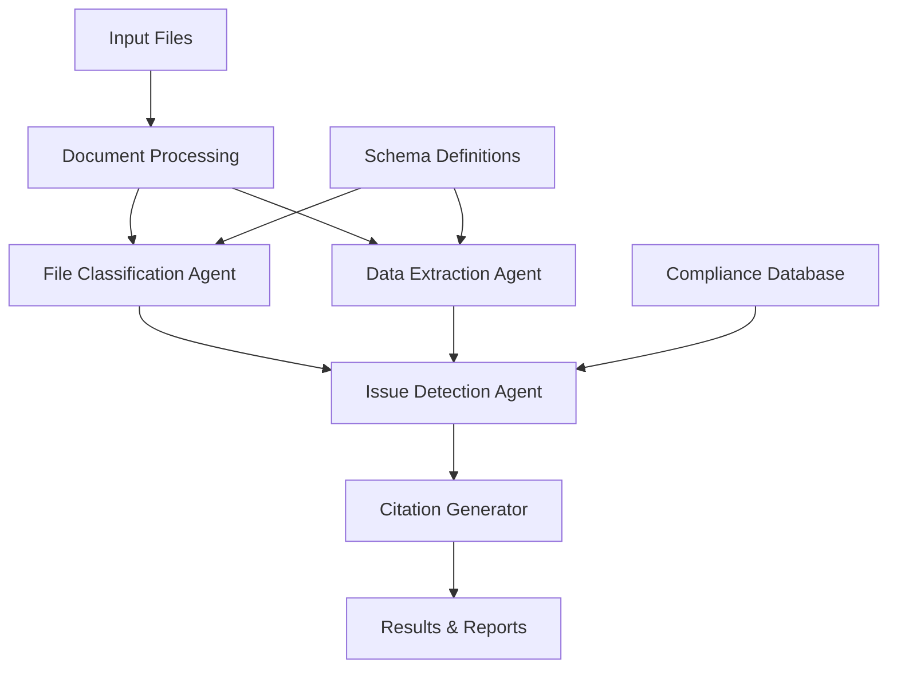

# Expense Processing System Workflow Documentation

## Overview

The Expense Processing System is a comprehensive AI-powered solution that processes expense documents (receipts, invoices) through multiple specialized agents to extract data, classify documents, detect compliance issues, and generate citations. The system uses structured output with Pydantic models for type safety and validation.

## System Architecture



## Workflow Components

### 1. File Classification Agent

**Purpose**: Determines if a document is an expense and categorizes it

**Input**:
- Raw markdown text from document OCR
- Expected country/location for validation
- Expense schema definitions

**Process**:
```python
result = classify_file(markdown_content, country)
response = file_classification_agent.run(formatted_prompt)
```

**Tasks**:
- Analyze document content against expense schema fields
- Identify document language and confidence
- Determine expense category (meals, accommodation, travel, etc.)
- Validate document location against expected location
- Calculate classification confidence scores

**Output** (Structured - `FileClassificationResult`):
```json
{
  "is_expense": true,
  "expense_type": "meals",
  "language": "German",
  "language_confidence": 95,
  "document_location": "Germany",
  "expected_location": "Germany",
  "location_match": true,
  "error_type": null,
  "error_message": null,
  "classification_confidence": 88,
  "reasoning": "Document contains required expense fields",
  "schema_field_analysis": {
    "fields_found": ["supplier_name", "total_amount", "date", "vat_number"],
    "fields_missing": ["employee_id"],
    "total_fields_found": 4,
    "expense_identification_reasoning": "Found 4 out of 5 required schema fields"
  }
}
```

### 2. Data Extraction Agent

**Purpose**: Extracts structured data from expense documents

**Input**:
- Markdown content from document
- Country-specific compliance requirements (JSON)
- Dynamic field extraction requirements

**Process**:
```python
result = extract_data_from_receipt(compliance_json, markdown_content)
```

**Tasks**:
- Extract required fields based on country/ICP requirements
- Identify additional relevant fields (line items, taxes)
- Convert field names to snake_case format
- Handle variable receipt structures
- Extract line-item details when present

**Output** (Dynamic JSON - not structured due to variable schema):
```json
{
  "supplier_name": "Restaurant ABC",
  "total_amount": "25.50 EUR",
  "transaction_date": "2025-01-15",
  "vat_number": "DE123456789",
  "currency": "EUR",
  "line_items": [
    {
      "description": "Pasta Carbonara",
      "amount": "18.50",
      "quantity": 1
    }
  ],
  "tax_amount": "4.08",
  "net_amount": "21.42"
}
```

### 3. Issue Detection Agent

**Purpose**: Analyzes extracted data against compliance requirements

**Input**:
- Country name (e.g., "Germany")
- Receipt type (e.g., "All", "Travel", "Meals")
- ICP name (e.g., "Global People", "goGlobal")
- Country-specific compliance data (JSON)
- Extracted receipt data (JSON)

**Process**:
```python
result = await analyze_compliance_issues(
    country, receipt_type, icp, compliance_data, extracted_json
)
response = issue_detection_agent.run(formatted_prompt)
```

**Tasks**:
- Cross-reference extracted fields against mandatory requirements
- Validate expense type against policy rules
- Check ICP-specific compliance requirements
- Identify tax exemption and gross-up scenarios
- Generate specific recommendations based on knowledge base
- Quote relevant compliance rules for each issue

**Output** (Structured - `IssueDetectionResult`):
```json
{
  "validation_result": {
    "is_valid": false,
    "issues_count": 2,
    "issues": [
      {
        "issue_type": "Standards & Compliance | Fix Identified",
        "field": "supplier_name",
        "description": "The supplier name 'Restaurant ABC' does not match the mandatory requirement 'Global People DE GmbH'.",
        "recommendation": "Contact the supplier to reissue the receipt with the correct supplier name.",
        "knowledge_base_reference": "Must be Global People DE GmbH for supplier name requirement."
      },
      {
        "issue_type": "Standards & Compliance | Gross-up Identified",
        "field": "expense_type",
        "description": "Personal meal expenses are not tax exempt as per policy for expenses outside business travel.",
        "recommendation": "Meal expenses are not tax exempt; they should be grossed-up accordingly.",
        "knowledge_base_reference": "Not tax exempt (outside business travel) for personal meal expenses."
      }
    ],
    "corrected_receipt": null,
    "compliance_summary": "Document has 2 compliance issues requiring attention"
  },
  "technical_details": {
    "content_type": "ReceiptValidationResult",
    "country": "Germany",
    "icp": "Global People",
    "receipt_type": "All",
    "issues_count": 2
  }
}
```

### 4. Citation Generator

**Purpose**: Generates citations linking extracted data to source documents

**Input**:
- Structured output from data extraction
- Extraction requirements (JSON string)
- Original markdown content
- Filename for saving citations

**Process**:
```python
citations_result = generate_citations(
    structured_output=parsed_result,
    extraction_requirements=compliance_json,
    markdown_content=markdown_content,
    filename=filename
)
```

**Tasks**:
- Match extracted field names to source document text
- Match extracted values to source document text
- Calculate confidence scores for each match
- Identify match types (exact, fuzzy, contextual)
- Provide context for validation
- Generate metadata about citation quality

**Output** (Structured - `CitationResult`):
```json
{
  "citations": {
    "supplier_name": {
      "field_citation": {
        "source_text": "Restaurant ABC",
        "confidence": 0.95,
        "source_location": "markdown",
        "context": "Header section of receipt",
        "match_type": "exact"
      },
      "value_citation": {
        "source_text": "Restaurant ABC GmbH",
        "confidence": 0.90,
        "source_location": "markdown",
        "context": "Business name in header",
        "match_type": "fuzzy"
      }
    }
  },
  "metadata": {
    "total_fields_analyzed": 8,
    "fields_with_field_citations": 6,
    "fields_with_value_citations": 7,
    "average_confidence": 0.87
  }
}
```

## Complete Workflow Process

### Phase 1: Document Ingestion
1. **Input**: Expense files (PDF, JPG, PNG, TIFF)
2. **OCR Processing**: Convert to markdown using LlamaParse
3. **Quality Assessment**: Evaluate image/document quality

### Phase 2: Parallel Processing
1. **Classification**: Determine if document is expense and categorize
2. **Data Extraction**: Extract structured data based on requirements

### Phase 3: Compliance Analysis
1. **Issue Detection**: Analyze extracted data against compliance rules
2. **Citation Generation**: Link extracted data to source documents

### Phase 4: Results Generation
1. **Structured Output**: Save results with type safety
2. **Individual Files**: Save classification, extraction, compliance separately
3. **Citation Files**: Save citation analysis separately
4. **Consolidated Reports**: Generate summary reports and analytics

## Key Features

### Structured Output Implementation
- **Type Safety**: Pydantic models ensure response validation
- **Consistency**: Guaranteed response structure across all agents
- **Error Prevention**: Malformed responses are caught automatically
- **IDE Support**: Full autocomplete and type hints

### Dynamic Schema Handling
- **Country-Specific**: Different requirements per country
- **ICP-Specific**: Different rules per ICP provider
- **Receipt-Type Specific**: Different validation for different expense types
- **Runtime Adaptation**: Schema determined at processing time

### Error Handling & Resilience
- **Graceful Degradation**: System continues processing even if individual components fail
- **Comprehensive Logging**: Detailed logs for debugging and monitoring
- **Fallback Mechanisms**: Default responses when agents fail
- **Incremental Saving**: Results saved immediately after each step

### Integration Points
- **Database Storage**: SQLite for workflow tracking
- **File Management**: Organized directory structure for results
- **API Integration**: Support for multiple LLM providers
- **Reporting**: Multiple output formats (JSON, CSV, Excel)

## Configuration

### Environment Variables
- `OPENAI_API_KEY`: OpenAI API access
- `ANTHROPIC_API_KEY`: Anthropic Claude API access
- `LLAMAPARSE_API_KEY`: Document parsing service

### Directory Structure
```
├── expense_files/          # Input documents
├── results/               # Main processing results
├── citation_folder/       # Citation analysis results
├── data/                  # Country compliance databases
├── llamaparse_output/     # OCR markdown output
└── quality_reports/       # Image quality assessments
```

This workflow ensures comprehensive, accurate, and compliant processing of expense documents with full traceability and validation at each step.
